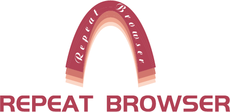
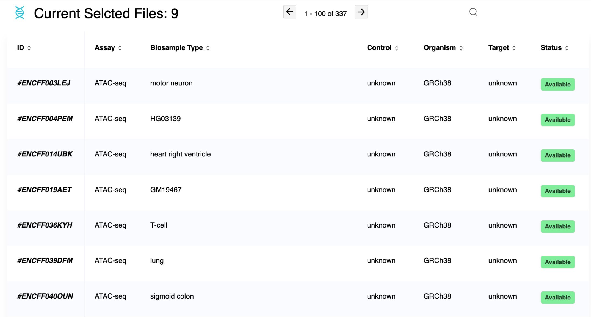
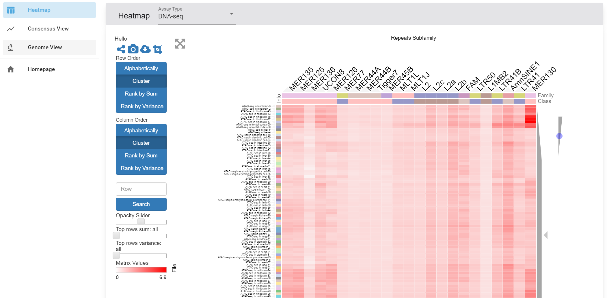
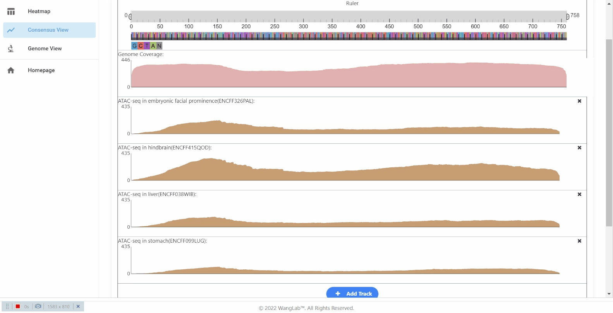
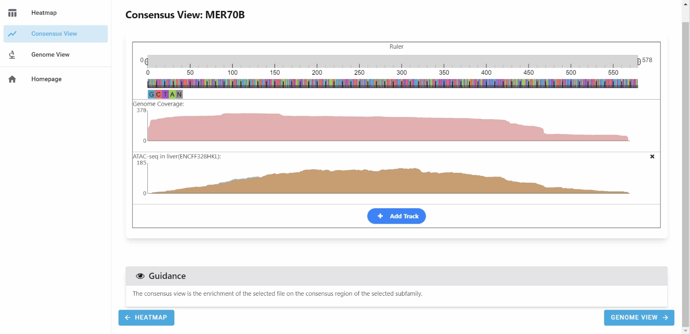

# WashU Repeat Browser Open Data

<p align="center">
  
</p>

The [WashU Repeat Browser](https://repeatbrowser.org/) dataset provides processed genomic and epigenomic profiles for studying repetitive elements and transposable elements in the human (`hg38`) and mouse (`mm10`) genomes. It integrates public data from ENCODE, Roadmap Epigenomics and FANTOM for TE-subfamily enrichment, consensus-sequence profiles and locus-level visualization.

The collection is approximately **2.19 TiB** and contains **8,774 processed dataset entries**: 5,680 for `hg38` and 3,094 for `mm10`. An entry is a processed data directory, often linked to an ENCODE file accession; it is not necessarily an independent biological experiment.

## Dataset coverage

| Assembly | Assay | Entries |
|---|---|---:|
| hg38 | ATAC-seq | 443 |
| hg38 | CAGE-seq and New CAGE-seq | 215 |
| hg38 | DNase-seq | 2,529 |
| hg38 | Histone ChIP-seq | 70 |
| hg38 | TF ChIP-seq | 2,423 |
| mm10 | ATAC-seq | 176 |
| mm10 | DNase-seq | 1,773 |
| mm10 | Histone ChIP-seq | 960 |
| mm10 | TF ChIP-seq | 185 |

## Organization

Data are organized by reference assembly, assay and processed accession:

```text
s3://washu-repeat-browser/
├── hg38/{atac-seq,cage-seq,newcage-seq,dnase-seq,chip-seq/{histone,tf}}/
├── mm10/{atac-seq,dnase-seq,chip-seq/{histone,tf}}/
├── documentation/
└── precomputedEnrichment/
```

Assay-level CSV tables connect processed files to source accessions and provenance. Common fields include file accession, experiment accession, assay, biosample, source URL and control accession.

## Data formats

### CSV and BigWig

CSV files provide searchable metadata and provenance. BigWig files contain indexed genomic signal tracks. ChIP-seq entries may include separate experimental signal and input-control tracks in `UNI` (uniquely mapped) and `ALL` (unique plus multi-mapped) representations.

### Zarr v2

Zarr stores contain chunked TE-subfamily summaries, consensus profiles and genomic loci:

```text
dataset.zarr/
├── .zgroup
├── .zattrs
├── .zmetadata
├── subfam_stat/
├── {all,uni}_bigwig/
├── loci_<subfamily>/
├── {signal,control}_{all,uni}_bigwig/       # Experiment mode
└── {signal,control}_loci_<subfamily>/       # Experiment mode
```

| Member | Description |
|---|---|
| `.zattrs`, `.zmetadata` | Dataset parameters, TE-subfamily labels and consolidated array metadata. |
| `subfam_stat` | Per-subfamily summary values; row meaning depends on processing mode. |
| `all_bigwig`, `uni_bigwig` | Consensus profiles for all-read and uniquely mapped representations. |
| `signal_*`, `control_*` | Experiment and matched-control profiles in ChIP-seq Experiment mode. |
| `loci_<subfamily>` | Locus records for File mode. |
| `signal_loci_<subfamily>`, `control_loci_<subfamily>` | Signal and control locus records for Experiment mode. |

Locus arrays are flattened one-dimensional string arrays. Every four values form one record:

```text
chromosome, start, end, RPKM
```

The TE subfamily is stored in the array name, such as `signal_loci_MER70B`. These arrays use Zlib compression. Inspect `.zattrs`, `.zmetadata` and the selected array's `.zarray` before analysis because available members vary by assay and processing mode.

## Access and tested examples

The public dataset is available without an AWS account at `s3://washu-repeat-browser` in `us-east-2`. See [download.md](download.md) for AWS CLI, HTTPS and Python examples.

### Read a locus-level Zarr chunk

This verified example reads `signal_loci_MER70B` from a public ChIP-seq Experiment-mode store:

```python
import zlib

import numpy as np
import requests

base = (
    "https://washu-repeat-browser.s3.us-east-2.amazonaws.com/"
    "hg38/chip-seq/histone/"
    "Processed_ENCFF032RWB_signal/ENCFF032RWB_signal.zarr/"
    "signal_loci_MER70B"
)

array_metadata = requests.get(f"{base}/.zarray", timeout=60).json()
compressed = requests.get(f"{base}/0", timeout=60).content
values = np.frombuffer(
    zlib.decompress(compressed), dtype=array_metadata["dtype"]
)[: array_metadata["shape"][0]]

loci = values.reshape(-1, 4)
print(loci[:5])  # chromosome, start, end, RPKM
```

The chunk contains 1,676 scalar values, corresponding to 419 locus records. Repeat Browser selects `signal_loci_*` for `Mode: Experiment` and ordinary `loci_*` for `Mode: File`.

## Using the data in Repeat Browser

Open [repeatbrowser.org](https://repeatbrowser.org/), select datasets by assay, biosample, target, organism or accession, and choose one or more TE subfamilies.



The Heatmap compares selected datasets across TE subfamilies. Clicking a cell opens Consensus View; Genome View can then inspect individual genomic copies.



Consensus View displays genome coverage and one or more selected signal tracks along the TE consensus sequence.





The Browser also accepts a public Zarr URL generated by the [Repeat Browser data-processing pipeline](https://github.com/twlab/Repeat-Browser_data_processing). The URL must support HTTP access and CORS.

## Examples from the publication

The [Repeat Browser paper](https://doi.org/10.1101/gr.279764.124) illustrates analysis at the TE-subfamily, consensus-sequence and individual-locus levels.

### STAT1 binding at MER41B

- **Data:** STAT1 ChIP-seq from IFNG-stimulated K562, HeLa-S3 and primary CD14+ macrophages.
- **Approach:** Compare 27 representative TE subfamilies, open MER41B in Consensus View and inspect genomic copies.
- **Observation:** Figure 2 shows STAT1 enrichment over MER41B in IFNG-stimulated HeLa cells. Eleven enriched copies were inspected with their flanking regions.
- **Data example:** `ENCFF076NFT.zarr` is an Experiment-mode HeLa-S3 STAT1 store. Its public [`signal_loci_MER41B/0`](https://wangftp.wustl.edu/~scheng/repeat_browser/paper_figure/chip-seq/HeLa-S3_STAT1/ENCFF076NFT.zarr/signal_loci_MER41B/0) chunk contains 2,118 locus records.

### Epigenetic treatment activates LTR12C

- **Data:** CAGE-seq comparing DMSO with DAC, SB939 and combined DAC+SB treatment.
- **Approach:** Compare LTR12C enrichment, locate active copies and view selected loci with histone-modification tracks.
- **Observation:** Figure 3 shows stronger LTR12C signals after DAC+SB and DAC treatment than in the DMSO control. Five enriched copies also showed H3K4me3 and H3K9ac peaks.
- **Data example:** `DACSB_PE_CAGE_SRR3498330.zarr` is a File-mode DAC+SB store. Its public [`loci_LTR12C/0`](https://wangftp.wustl.edu/~scheng/repeat_browser/paper_figure/rna-seq/DACSB_PE_CAGE_SRR3498330.zarr/loci_LTR12C/0) chunk contains 2,300 locus records.

## Update frequency

The collection is updated irregularly as new supported public datasets and processed profiles become available.

## License, citation and contact

Dataset license: [Creative Commons Attribution 4.0 International](https://creativecommons.org/licenses/by/4.0/) (CC BY 4.0).

Suggested citation:

> Shen J, Cheng S, Purushotham D, Zhuo X, Du AY, Zhang W, Li D, Wang T. Exploring the epigenome profiles of repetitive elements with the WashU Repeat Browser. *Genome Research*. 2025. https://doi.org/10.1101/gr.279764.124

Contacts: Jiawei Shen (`jiaweishen@wustl.edu`) and Daofeng Li (`dli23@wustl.edu`), Ting Wang Laboratory, Department of Genetics, Washington University in St. Louis.

## Step 2 package

| File | Purpose |
|---|---|
| `washu-repeat-browser.yaml` | AWS Open Data Registry metadata entry |
| `download.md` | AWS CLI, HTTPS and Python access guide |
| `get-to-know-washu-repeat-browser.ipynb` | Introductory AWS tutorial notebook |
| `repeat-browser-aws-open-data-application-draft.docx` | AWS Open Data Sponsorship application responses |
| `repeat-browser-aws-feature-draft.docx` | Five-question institutional provider profile |
| `assets/` | Logo and four interface examples |

The bucket supports anonymous `ListBucket` and `GetObject` access, HTTPS range requests and CORS. Requester Pays is disabled and an AWS account is not required.

## Related resources

- [Repeat Browser](https://repeatbrowser.org/)
- [Documentation](https://rb-doc.readthedocs.io/en/latest/)
- [Application repository](https://github.com/twlab/Repeat-Browser)
- [Processing repository](https://github.com/twlab/Repeat-Browser_data_processing)
- [Reference publication](https://doi.org/10.1101/gr.279764.124)
